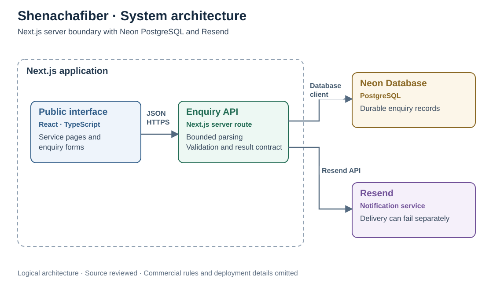

# Shenachafiber

### Enquiry handling: validation, durable storage, and honest recovery

[Lawi Mwaura](https://github.com/Lawi-Mwaura) · [Source repository](https://github.com/Lawi-Mwaura/shenachafiber)

*Actual homepage excerpt from the repository’s interface captures. No submitted enquiry records are shown.*

## Problem statement

An enquiry can be stored successfully even when its notification fails. Users need an accurate submission result, while malformed inputs and storage outages must be handled explicitly.

## Technologies used

TypeScript · Next.js · React · Neon / PostgreSQL · Resend · Vitest

## Engineering scope

A Next.js website with structured enquiry journeys, server-side validation, PostgreSQL persistence, and notification delivery. The engineering focus is accurately telling a user whether their request was saved when part of the system is unavailable.

**Technologies:** TypeScript, Next.js, React, Neon / PostgreSQL, Resend, Vitest.

## System design

**Component architecture.** The boxes identify technologies and responsibilities; boundaries group the application runtime and managed backend. Relationships show dependencies and integration protocols, rather than a step-by-step processing flow.

## Challenges and engineering decisions

| Failure or constraint | Design response |
| :--- | :--- |
| Malformed or oversized input | Validate request parsing and reject invalid input before persistence. |
| Different enquiry journeys | Apply validation according to the submitted journey rather than relying only on visible form fields. |
| Storage unavailable | Return an explicit unavailable result without claiming that details were received. |
| Notification fails after saving | Preserve the saved result and report the notification failure separately. |
| A reference is needed for follow-up | Return a non-sequential public reference rather than exposing the internal record identifier. |
| Personal information in logs or caches | Use minimal error metadata and no-store responses for submission results. |

## Tradeoffs

**A notification is not the durable record.** Saving before notification makes the response depend on persistence. Reliable retries for email delivery are a separate operational concern, rather than a reason to tell a user that an already-saved request failed.

**Availability must be communicated honestly.** A temporary database outage produces an explicit failure response. The interface can preserve entered values and offer a useful fallback instead of showing a success state that the backend cannot support.

**Validation is a shared contract.** Keeping parsing and validation separate from the route makes malformed input and conditional fields testable without a live database.

## Outcomes

- Storage success determines the submission result; notification failure is reported separately.
- Conditional validation and bounded parsing reject invalid input before persistence.
- Unavailable storage returns an explicit failure rather than a false success.
- Public references support follow-up without exposing internal record identifiers.

These are implementation outcomes supported by the reviewed source, not measured production improvements.

## Metrics and evidence

| Measure | Evidence |
| :--- | :--- |
| Selected tests | **27 passed across three suites** on 1 October 2026. |
| Test scope | Lead validation, notification formatting, and enquiry route with isolated dependencies. |
| Production metrics | No verified conversion, delivery-rate, uptime, or response-time figures supplied. |

## Validation

On **1 October 2026**, **27 tests across three selected suites passed**: lead validation, notification formatting, and the enquiry API route. These cover validation, persistence outcomes, missing storage configuration, and route responses through isolated tests.

The selected run did not exercise a live database, real email delivery, or deployment availability. The repository’s configured public preview URL was unavailable during this portfolio review, so the README uses an actual repository capture and links to source rather than advertising a working demo.

[Contact Lawi](mailto:lawimwaura@gmail.com)

## Development

[Developer guide](docs/development.md) · [Source repository](https://github.com/Lawi-Mwaura/shenachafiber)

