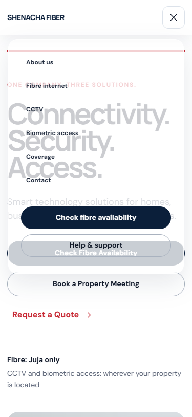
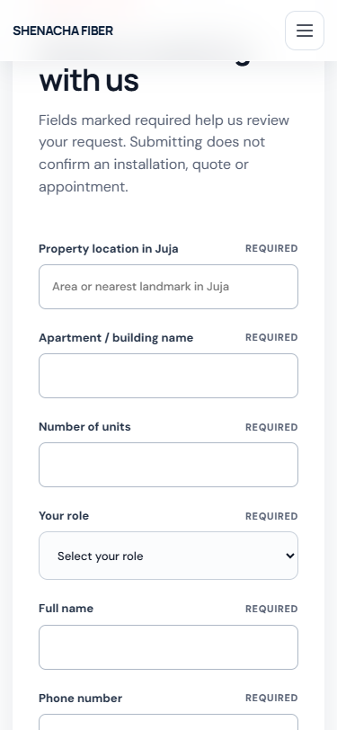
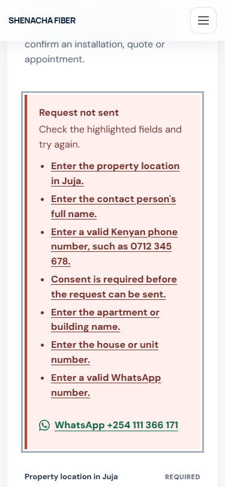

# Shenacha whole-site UI/UX audit

Date: 2026-08-27  
Viewports audited: desktop 1440x1000 and mobile 375x812

The screenshot-backed audit covered all ten primary routes, desktop and mobile navigation, and form-error states. Thirty-one fresh images were inspected. Six invalid compositing captures were rejected and are not used as evidence.

- [Complete detailed audit](qa/ui-audit-complete.md)
- [Accepted screenshot evidence](qa/audit-current)
- [Capture metrics](qa/audit-current/capture-metrics.json)

## Overall verdict

The site has a strong editorial foundation: confident typography, restrained navy/red branding, relevant photography, clear service-area messaging, and reliable responsive reflow.

It is not yet at an Apple-quality finish because the interaction layer and design-system discipline trail the page compositions. The main problems are structural rather than a lack of decorative polish.

## Key visual evidence

### Mobile navigation collision

The translucent menu exposes the hero and page calls to action underneath. Menu controls visually collide with live page controls, and the menu begins 8px below the header.

### About page placeholder-like bands

Large grey areas surrounding the value cards resemble unfinished placeholders rather than intentional whitespace.

### Fibre deep-link obstruction

The property-meeting deep link places the heading underneath the sticky header. The page also reaches 9,031px on mobile because it renders two complete forms.

### Error-state inconsistency

The error summary is useful and correctly receives focus, but it becomes very long on mobile. Invalid selects retain neutral styling while invalid text fields turn red.

## Route health

| Step | Route | Health |
| --- | --- | --- |
| 1 | Home | Strong base; competing hero actions |
| 2 | About | Visible layout defect; shallow trust story |
| 3 | Fibre internet | Highest friction; urgent form corrections |
| 4 | CCTV | Coherent template; overlay and error-state issues |
| 5 | Biometric access | Coherent; awkward wrapping and generic copy |
| 6 | Coverage | Clear journey; defensive copy and oversized poster |
| 7 | Contact | Clean cards; too many equal choices |
| 8 | Enquire | Useful form; unclear navigation ownership and poor crop |
| 9 | Help | Strongest utility route; inconsistent discoverability |
| 10 | Privacy | Healthy reading layout; footer feels disproportionately heavy |

## Confirmed strengths

- Strong editorial type and a consistent navy/red visual identity.
- Clear distinction between Juja fibre availability and location-independent CCTV/biometric work.
- Meaningful imagery with responsive sizing and useful alternative text.
- Reliable mobile reflow with no horizontal page overflow in the audited routes.
- Semantic landmarks, skip link, visible focus styles, reduced-motion support, and generally comfortable touch targets.
- Form loading, success, error-summary, field-error, and WhatsApp recovery states.
- The Help route is particularly scannable and gives support, payment, warning, and escalation content distinct roles.

## Confirmed P0 issues

### 1. Repair the mobile-menu foreground/background model

The translucent menu exposes and collides with the hero and page calls to action.

Implementation:

- Use an opaque-enough surface or scrim.
- Prevent underlying controls from being clicked or focused while the menu is open.
- Keep menu content in one unambiguous visual layer.
- Preserve Escape-to-close and return focus to the menu trigger.

### 2. Unify header and menu geometry

The mobile menu begins at y=76 while the mobile header ends at y=68.

Implementation:

- Define one `--header-height` token.
- Derive header height, menu inset, and available menu height from that token.
- Remove competing 1050px and 1100px navigation breakpoints.

### 3. Make every rendered form ID unique

The two Fibre forms duplicate these IDs:

- `location`
- `building`
- `name`
- `phone`
- `whatsapp`
- `message`
- `consent`

Implementation:

- Add a journey-specific `idPrefix` to each form instance.
- Generate every control, helper, error, and error-summary anchor from the prefix.

### 4. Complete required and invalid semantics

- Add native `required` or `aria-required="true"` where appropriate.
- Give invalid selects the same visible error treatment as invalid inputs.
- Keep adjacent error messages so color is not the only signal.

### 5. Repair deep-link positioning

Property-meeting deep links place the heading underneath the sticky header.

Implementation:

- Add header-aware `scroll-margin-top` to every deep-link target.
- Verify property-meeting, resident-inquiry, availability-form, and quote-form anchors.

## Route findings

### 1. Home

Strengths:

- Strong desktop hero balance and useful apartment crop.
- Service rows create a clear editorial rhythm.
- Mobile imagery remains legible without overflow.

Issues:

- Three hero actions compete.
- The hero-to-services gap weakens continuity.
- Service-title punctuation is inconsistent.
- The floating WhatsApp control occupies unreserved page space.

### 2. About

Strengths:

- Hero copy and technician image are balanced.
- The three values stack cleanly on mobile.

Issues:

- Large grey bands look like missing content.
- The page repeats positioning without adding enough assessment, installation, or support detail.

### 3. Fibre internet

Strengths:

- Pricing is immediately understandable.
- Hero, package card, and audience labels are clear.
- The poster is uncropped and readable when in view.

Issues:

- The mobile page is 9,031px tall.
- Two complete forms produce unnecessary friction and duplicate IDs.
- The owner form is visually much denser than its adjacent desktop copy.
- Deep-linked headings are obstructed by the sticky header.
- Poster content is repeated on Fibre and Coverage.
- `Submit a fibre inquiry` breaks the site's British `enquiry` convention.

### 4. CCTV

Strengths:

- Relevant hero crop and scannable scope lists.
- Clear mobile hierarchy.

Issues:

- The desktop WhatsApp pill overlaps content.
- The glass form card feels detached from the flat editorial page.
- Invalid property-type selects keep their neutral visual state.

### 5. Biometric access

Strengths:

- Strongest service-to-image match in the site.
- Balanced scope at desktop and mobile widths.

Issues:

- `Request an access-control quote` wraps awkwardly.
- `Other suitable properties` is generic and wraps more heavily than its peers.
- The desktop WhatsApp pill overlaps content.

### 6. Coverage

Strengths:

- Clear poster-to-form journey.
- Poster remains uncropped on both widths.
- Error summary is prominent and actionable.

Issues:

- `There is no fake instant checker` sounds defensive.
- The poster delays access to the form on mobile.
- The desktop WhatsApp control covers poster-explanation copy.
- The mobile error summary is useful but excessively long.

### 7. Contact

Strengths:

- Direct-contact cards are symmetric on desktop and stack cleanly on mobile.
- Phone, WhatsApp, and email are clearly differentiated.

Issues:

- Three contact methods are followed by four more equally weighted journey links.
- Desktop hero whitespace is substantial despite lacking a primary action.
- `For properties wherever located` is awkward wording.

### 8. Enquire

Strengths:

- Journey selection provides progressive disclosure.
- Mobile form controls are comfortably sized.

Issues:

- The route is in the sitemap but has no clear internal-navigation ownership.
- Rounded pale-blue and glass treatments depart from the editorial service routes.
- The hero image leaves an accidental partial face at the edge.
- The general page defaults to fibre before the user acts.

### 9. Help

Strengths:

- Strongest utility route in the site.
- Troubleshooting steps are highly scannable.
- Support, payment, warning, and escalation content have distinct roles.

Issues:

- Help is prominent in mobile navigation but absent from desktop primary navigation.
- `Back to home` partly duplicates the persistent header brand.

### 10. Privacy

Strengths:

- Controlled desktop line length.
- Natural mobile reflow and useful heading hierarchy.
- No clipping or overflow observed.

Issues:

- The footer feels disproportionately heavy beneath the narrow article.
- `Back to home` repeats the header-brand action.

## Implementation plan

### Phase 1 - interaction and accessibility blockers

- Repair mobile-menu surface, scrim, geometry, scroll locking, focus containment, and focus return.
- Prefix form IDs and their ARIA relationships.
- Add required semantics and select error styling.
- Add sticky-header-safe deep-link offsets.

Acceptance:

- The open menu is isolated from page content at 375, 768, and 1024px.
- Underlying controls cannot be focused or clicked while the menu is open.
- Fibre has no duplicate IDs or broken ARIA references.
- Every invalid control has visible and programmatic error state.
- Deep-linked headings remain fully visible beneath the header.

### Phase 2 - system cleanup

- Remove unused legacy CSS families.
- Merge the canonical override layer into one component system.
- Define semantic tokens for typography, spacing, radius, elevation, glass, z-index, header height, and breakpoints.
- Refactor shared hero, form card, section heading, and footer patterns.
- Restrict glass to genuinely layered or transient surfaces.

Acceptance:

- One rule source exists per shared component.
- No competing navigation breakpoints remain.
- Approved token scales control radius and spacing.
- Shared changes do not unexpectedly alter unrelated routes.

### Phase 3 - journey and copy simplification

- Decide whether `/enquire` is the universal enquiry route.
- Show only one Fibre audience journey and form at a time.
- Reduce action competition on Home and Contact.
- Split footer enquiries from support.
- Normalize terminology, title punctuation, and sentence-case calls to action.
- Replace defensive coverage wording with a positive manual-confirmation promise.

Acceptance:

- One action is visually dominant per viewport.
- Users do not compare more than three equal options to find an enquiry path.
- Fibre's default mobile journey is materially shorter than 9,031px.

### Phase 4 - visual verification

- Re-capture all routes at 1440, 1024, 768, 390, and 375px.
- Verify image crops, text wrapping, footer balance, glass contrast, poster prominence, and error states.
- Test 200% zoom and landscape mobile.
- Run keyboard, VoiceOver/NVDA, and automated accessibility checks after structural corrections.

## Accessibility verification still required

Screenshots and DOM metrics cannot establish complete accessibility compliance. The following remain separate verification tasks:

- VoiceOver and NVDA announcement quality and reading order.
- Full keyboard order, menu focus containment, and route-change focus.
- 200% and 400% zoom and text-only enlargement.
- Measured contrast for every text, surface, and focus-state combination.
- Automated accessibility checks after duplicate IDs and ARIA relationships are corrected.
- Real-device touch and screen-reader error recovery.

No application code was changed during the audit.
